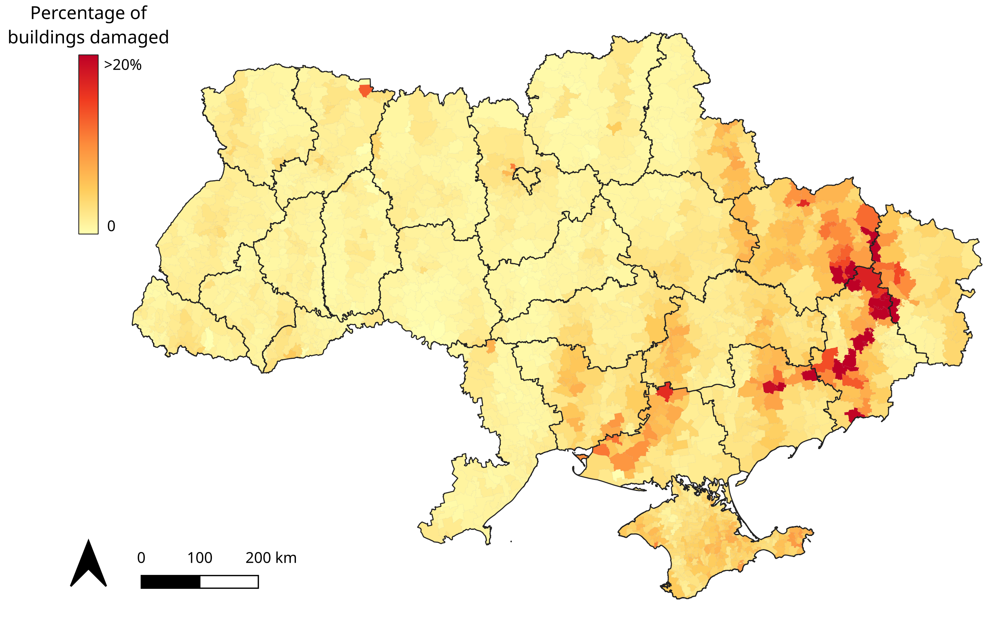
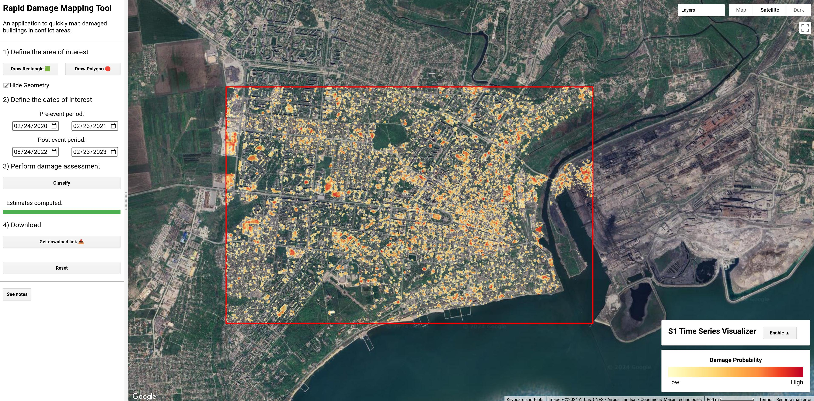
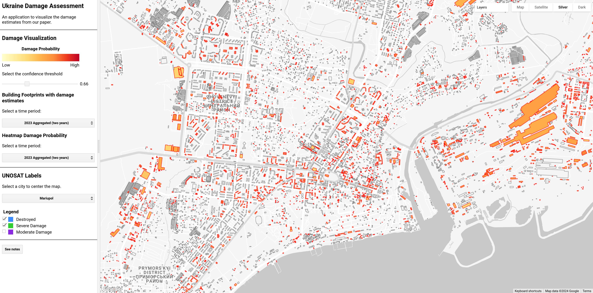

# An Open-Source Tool for Mapping War Destruction at Scale in Ukraine using Sentinel-1 Time Series

<div align="center">

**Olivier Dietrich<sup>*,1</sup>**, **Torben Peters<sup>1</sup>**, **Vivien Sainte Fare Garnot<sup>2</sup>**, **Valerie Sticher<sup>2</sup>**, **Thao Ton-That Whelan<sup>3</sup>**, **Konrad Schindler<sup>1</sup>**, **Jan Dirk Wegner<sup>2</sup>**

<sup>1</sup> ETH Zurich
<sup>2</sup> University of Zurich
<sup>3</sup> International Committee of the Red Cross

<sup>*</sup>Corresponding author: [Olivier Dietrich](mailto:odietrich@ethz.ch)

[](https://arxiv.org/abs/2406.02506)
[](https://olidietrich.users.earthengine.app/view/rapid-damage-assessment-sentinel1)
[](https://olidietrich.users.earthengine.app/view/ukraine-damage-explorer)




</div>


## 🇺🇦 Results
The results, including heatmaps and building footprints, can be found here:  ⏳ <span style="color:red; font-weight:bold;">COMING SOON</span>⏳

## 🎮 Dashboards
We provide two Google Earth Engine dashboards:

|[](https://olidietrich.users.earthengine.app/view/rapid-damage-assessment-sentinel1)<br>[Damage Mapping Tool](https://olidietrich.users.earthengine.app/view/rapid-damage-assessment-sentinel1)|[](https://olidietrich.users.earthengine.app/view/ukraine-damage-explorer)<br>[Ukraine Damage Explorer](https://olidietrich.users.earthengine.app/view/ukraine-damage-explorer)|
|:-:|:-:|


## 🌲 Repository Structure

```
notebooks/                     # Jupyter notebooks to reproduce results
  ├── classification.ipynb
  ├── country_stats.ipynb
  └── evaluation.ipynb

src/                            # Source code for data processing, model training, and inference
  ├── classification/           # Classification script to train and evaluate models
  │     ├── dataset.py
  │     ├── main.py
  │     ├── metrics.py
  │     ├── models.py
  │     ├── reducers.py
  │     └── utils.py
  │
  ├── data/                     # Scripts for data processing and handling
  │     ├── overture/
  │     ├── sentinel1/
  │     ├── sentinel2/
  │     ├── quadkeys.py
  │     ├── unosat.py
  │     └── utils.py
  │
  ├── inference/                # Script for inference over entire country
  │     ├── dense_inference.py
  │     └── full_ukraine.py
  │
  ├── postprocessing/           # Download from drive and postprocess results
  │     ├── drive_to_results.py
  │     └── utils.py
  │
  ├── utils/                    # Utils functions
  |     ├── gdrive.py
  |     ├── gee.py
  |     ├── geo.py
  |     └── time.py
  │
  ├── constants.py
  └── __init__.py
```

## 🛠️ Setup

*This was tested on Ubuntu 22.04 LTS with Python 3.12.7 and 64GB RAM*

### 🐑 Clone the repository
```bash
git clone https://github.com/odietric/ukraine-mapping-tool.git
cd ukraine_mapping
```

### 🐍 Python Environment
To create the environment, run the following command:

```bash
conda create -p ./ukraine_env python=3.12 geopandas gdal -c conda-forge --strict-channel-priority --yes
./ukraine_env/bin/python -m pip install uv
./ukraine_env/bin/python -m uv pip install -r requirements.txt
```
or simply:

```bash
make env
```

### 💾 Data
All project data is publicly available:

- [UNOSAT](https://unosat.org/products/)

  Preprocessed UNOSAT labels and AOIs are stored in `data/unosat_labels.geojson` and `data/unosat_aois.geojson`, respectively.
- [Sentinel-1](https://scihub.copernicus.eu/)

  Sentinel-1 images are processed in the cloud via Google Earth Engine.
- [Overture Maps Building Footprints](https://docs.overturemaps.org/guides/buildings/#14/32.58453/-117.05154/0/60)

  To obtain the preprocessed Overture Maps Building Footprints in Ukraine, you can either download the file `ukraine_buildings.parquet` from the link above and place it in the `data/overture_buildings` folder, or compute it yourself by running the following command:

  ```bash
  bash src/data/overture/download_and_preprocess.sh
  ```

### 💽 Google Drive Access Configuration

To download the results from Google Drive, you need to configure the Google Drive API and add the files `pydrive_settings.yaml` and `pydrive_credentials.json` to the `secrets` folder.

1. **Create Google API Credentials:**

    * Go to Google Cloud Console: API & Services > Credentials > Create Credentials > OAuth client ID > Desktop app.

2. **Download and Configure Credentials:**

    * Download the .json credentials file.

    * Store the `client_id` and `client_secret` values from this file in pydrive_settings.yaml as follows:

      ```yaml
      client_config_backend: 'settings'

      client_config:
        client_id: <your_client_id>
        client_secret: <your_client_secret>

      save_credentials: True
      save_credentials_backend: 'file'
      save_credentials_file: </path/to/project/>secrets/pydrive_credentials.json

      get_refresh_token: True
      oauth_scope:
        - "https://www.googleapis.com/auth/drive"
      ```

    * Replace `<your_client_id>` and `<your_client_secret>` with values from your credentials JSON file.

    * Replace `/path/to/project/secrets/pydrive_credentials.json` with the full path to the `pydrive_credentials.json` file within your project.\
    * The pydrive_credentials.json file will be automatically created upon the first authentication attempt.

3. **Example usage in code:**

      ```python
      from pydrive2.auth import GoogleAuth
      from pydrive2.drive import GoogleDrive
      from src.constants import SECRETS_PATH

      # Initialize authentication
      GoogleAuth.DEFAULT_SETTINGS["client_config_file"] = SECRETS_PATH / "pydrive_credentials.json"
      gauth = GoogleAuth(settings_file=SECRETS_PATH / "pydrive_settings.yaml")
      drive = GoogleDrive(gauth)
      ```

## Citation
```bibtex
@article{dietrich2024ukraine,
  title={An Open-Source Tool for Mapping War Destruction at Scale in Ukraine using Sentinel-1 Time Series},
  author={Olivier Dietrich and Torben Peters and Vivien Sainte Fare Garnot and Valerie Sticher and Thao Ton-That Whelan and Konrad Schindler and Jan Dirk Wegner},
  journal={arXiv preprint arXiv:/2406.02506},
  year={2024},
  url={https://arxiv.org/abs/2406.02506},
}
```

## License
This project is licensed under the MIT License - see the [LICENSE](LICENSE) file for details.